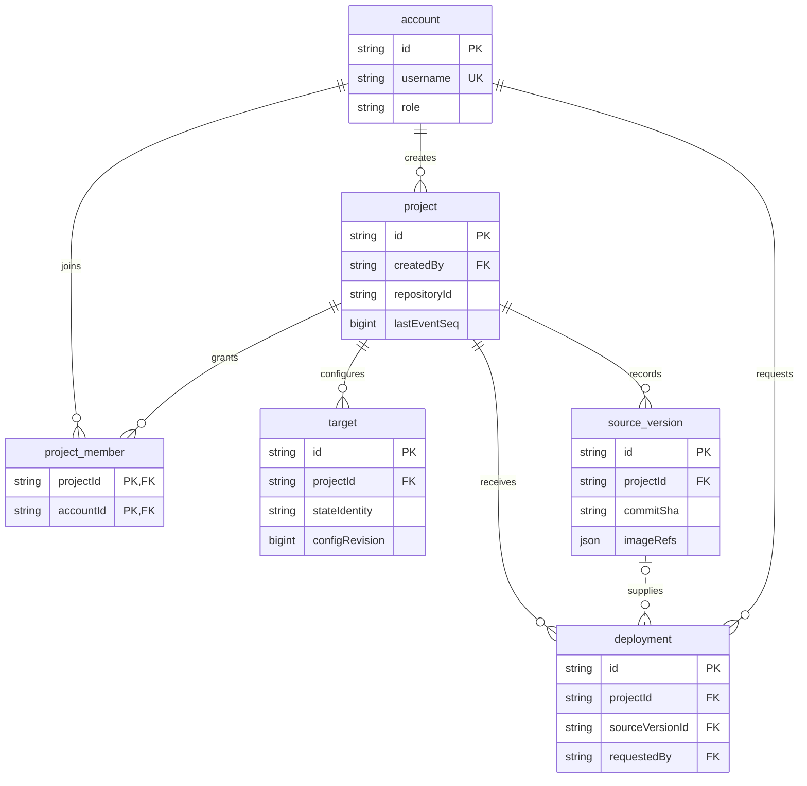
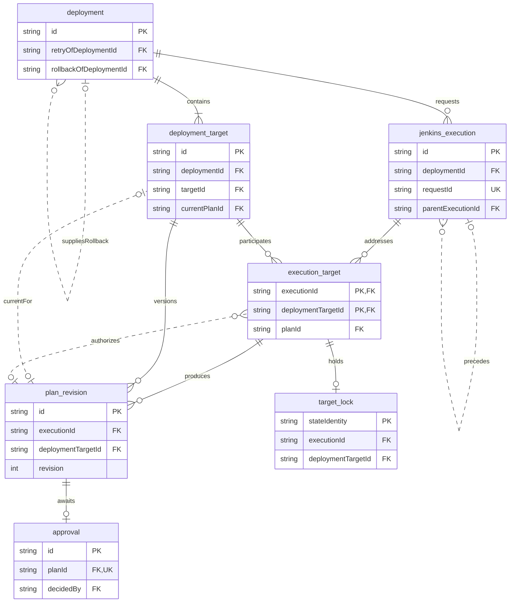
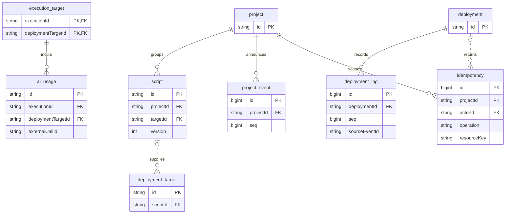

# 백엔드 DB 설계 — Jenkins 실행·승인·이력

기준일: 2026-10-01 (#19·#17·#13 피드백 반영). **DB 설계 검토안이다. JPA 엔티티·공통 기반 범위는 [SPEC](../SPEC.md)에 따르며, 마이그레이션·업무 동작·DB 적용은 별도 작업이다.**

사용자 저장소 빌드, 이미지 게시, Claude 호출, Terraform 생성·검증·실행은 인프라 Jenkins가 담당한다. 백엔드는 사용자가 요청한 입력, Jenkins 명령, 승인한 정확한 plan, 실제 결과의 연결을 보존한다. 백엔드가 Terraform이나 AI 실행기를 다시 만들지 않는다.

이 문서는 백엔드가 채택할 설계를 구체화한 검토안이다. 내부 이름·관계·정책을 아래와 같이 제안하고 인프라와 은현이 PR에서 확인한다. 외부 계약의 확인이 필요하다는 이유로 모든 컬럼을 미정으로 남기지 않는다. API 경로·응답 enum 변경이나 Jenkins 기능 구현 완료를 선언하는 문서는 아니다.

## 1. 범위와 결정

| 구분 | 이 설계의 선택 |
|---|---|
| 기본 저장소 | PostgreSQL, 단일 백엔드 DB. 기존 Java/JPA/Flyway 기반을 전제로 설계 |
| 기존 이름 유지 | `account`, `source_version`, `deployment_log` 유지. 외부 초안의 `app_user`, `build`, `deployment_event`와 각각 대응 |
| 기본 테이블 | 아래 17개. `project_member`는 프로젝트별 접근을 명확히 하기 위해 채택하고, `target_lock`은 승인 후 state 충돌 조정에 사용 |
| 인증·인가 소유 | **은현**: 로그인, Bearer 발급·검증, 계정·역할·프로젝트 접근 정책. 승환 실행 서비스도 해당 접근 서비스를 호출하며 API 검사를 믿고 생략하지 않음 |
| 실행 규칙 소유 | **승환**: 배포·plan·승인 유효성, 명령 전달·결과 수신, 멱등성·복구·실행 충돌 |
| 산출물 | 인프라가 원문을 보관하고 DB는 참조·전체 digest·안전한 요약을 저장. 원문 plan/state·비밀값 저장 제외 |
| 명령과 run | `jenkins_execution` 한 행은 명령 한 건. 여러 명령이 같은 Jenkins run을 가리킬 수 있고 한 명령은 여러 target을 다룰 수 있음 |
| 재시도·롤백 | 새 deployment 생성. retry는 실패 요청과의 계보, rollback은 **복원할 성공 배포**와의 관계로 구분 |
| SSE | `deployment_log`, `project_event`가 durable 재생 원본. 상태 테이블을 이벤트에서 재구축하는 이벤트 소싱은 사용하지 않음 |
| 추가하지 않는 것 | 별도 outbox, 범용 RBAC·조직/테넌트, 그래프, 단계별 테이블, 원문 artifact 중앙 저장소, 별도 환율 테이블 |

17개는 account, project, project_member, target, source_version, deployment, deployment_target, jenkins_execution, execution_target, plan_revision, approval, script, ai_usage, deployment_log, project_event, idempotency, target_lock이다. APNs용 device는 기본 17개에 포함하지 않고 부록에서만 다룬다.

## 2. DDD 경계와 소유

단일 모듈의 기능 패키지 경계다. **모든 테이블이 aggregate root인 것은 아니다.** 테이블 하나마다 별도 도메인·서비스를 만들지 않는다. 다른 경계의 Entity/Repository를 직접 수정하지 않고 서비스 계약으로 요청한다. DB FK는 코드 패키지 경계와 별도로 데이터 무결성을 지킨다.

| 경계 | aggregate·소유 데이터 | 변경 책임·연결 |
|---|---|---|
| `identity` | Account | 은현. 인증·역할·활성 여부 판정. execution은 인증된 actor ID를 받고 접근 서비스로 재검증 |
| `project` | Project와 membership; Target; SourceVersion | 은현. 관리·입력 조회, 프로젝트 접근, 대상 설정과 버전. 승환이 받은 빌드 결과는 이 경계의 수신 서비스로 전달 |
| `deployment` | Deployment와 DeploymentTarget, PlanRevision, Approval | 승환. 입력 고정·상태 집계·승인·retry/rollback. 한 배포 안의 변경을 같은 짧은 트랜잭션에서 판단 |
| `jenkins` | JenkinsExecution와 ExecutionTarget, TargetLock | 승환. 명령 payload 고정·전달·조회·복구. domain 상태 변경은 deployment 서비스와 한 application 트랜잭션으로 조정 |
| `script` · `ai` | Script; AiUsage | 승환 수신·검증·중복 방지. 은현 조회·합산. 실제 코드 재사용 판단·보관은 인프라 소유 |
| `history` · `idempotency` | DeploymentLog, ProjectEvent; Idempotency | 승환 실행 변경과 원자적으로 기록하는 지원 데이터. 은현은 조회 서비스와 SSE 기반을 사용 |

Account나 Project를 통째로 배포 aggregate에 포함하지 않는다. 실행용 snapshot을 취득하고 원본 ID를 유지한다. Project 상태를 수정하는 명령과 Deployment 상태 변경 명령은 각 소유 서비스가 담당한다. 교차 경계의 원자성이 필요한 수신·배포 접수는 단일 DB application 트랜잭션으로 묶을 수 있으며 외부 HTTP 호출은 포함하지 않는다.

후속 엔티티 초안은 각 기능의 `domain` 패키지에 둔다. 이번 단계는 private 필드와 JPA 매핑·복합키·배포 상태 타입만 정의하며, 생성/조회 메서드와 상태 전이 동작은 실제 사용 사례 구현 시 추가한다. FK는 scalar ID로만 매핑하므로 DB FK·CHECK·부분 UNIQUE·기본값은 후속 Flyway에서 구현해야 한다. JPA의 일반 UNIQUE 선언도 마이그레이션 없는 DB에 자동 적용되지 않는다.

## 3. ERD

그림은 핵심 키만 표시한다. 전체 컬럼·NULL·제약은 5장에 있다. 여러 그림에 나타나는 deployment 등은 같은 테이블이다.

### 3.1 계정·프로젝트·입력

### 3.2 배포·실행·승인

### 3.3 산출물·사용량·재생

## 4. 공통 표기·데이터 규칙

- 사전의 `NN`은 NOT NULL, `NULL`은 nullable이다. 기본값 `—`는 DB 기본값 없음이며, NN 컬럼은 생성 주체가 반드시 제공한다. `NULL`은 알 수 없음/아직 발생하지 않음을 뜻하고 0·빈 문자열로 대체하지 않는다.
- `ID`는 `varchar(64)`. 기존 외부 접두사 `prj_`, `src_`, `tgt_`, `dep_`, `apv_`, `job_`를 유지한다. 내부 새 ID의 접두사는 API 계약이 아니며 생성 후 불변이다. 로그·멱등성 내부 PK만 `bigint identity`를 사용한다.
- 시간은 `timestamptz`, UTC 응답. `now()`는 DB 트랜잭션 시간이다. 원천 사건 시간과 수신 시간은 따로 저장한다. 미래/과거 원천 시각만으로 이벤트 순서를 판단하지 않는다.
- `digest`는 `varchar(128)`이며 알고리즘 접두사를 포함한 전체 값, `commit_sha`는 `varchar(64)`이며 전체 Git commit 식별자다. UI의 축약 문자열을 FK·동일성 검사에 사용하지 않는다.
- JSONB는 문서 형태·필수 키·크기 상한을 수신 경계에서 검사한다. payload당 256 KiB, 단일 로그 message 16 KiB를 1차 제안값으로 둔다. 원문 secret·인증 토큰·tfstate·raw plan을 포함하지 않는다. 참조 URI에 서명 토큰을 영구 저장하지 않는다.
- image_refs는 MSA를 지원하는 **service 이름→이미지 객체** JSONB다. 각 객체에 `image_ref`, 전체 `digest`(제공된 경우), `commit_sha`를 보존한다. 단일 서비스도 같은 구조를 쓰며 scalar image 컬럼과 이중 관리하지 않는다. 실행에 사용할 불변 이미지 식별은 digest 우선, 없으면 변경 불가 정책이 적용된 commit 태그의 전체 참조를 요구한다.
- A-02/A-04의 환경별 scalar `image_digest` 요구는 API projection으로 맞춘다. 단일 서비스는 그 digest를 사용할 수 있으나 MSA에서 임의의 첫 서비스를 대표로 고르지 않는다. 여러 서비스의 응답 방식은 은현·web/ios와 확인하며 DB map을 유지한다.
- PK/FK는 삭제 CASCADE 없이 기본 RESTRICT/NO ACTION. 계정 비활성화·프로젝트/대상 보관 처리로 이력을 유지한다. 순환 FK는 생성 순서상 nullable 포인터를 마지막에 연결한다.
- PK·UNIQUE 제약이 만드는 인덱스와 동일하거나 선두 컬럼으로 충족되는 조회 인덱스는 중복 생성하지 않는다. 아래 INDEX 표기는 필요한 조회 경로이며 실제 DDL에서 기존 제약 인덱스와 대조한다.
- enum은 PostgreSQL enum 타입 대신 `varchar(32/64)` + CHECK로 관리한다. 배포·대상·step 값은 확인한 기존 iOS SPEC을 유지한다(6장). 새 명령·수신 처리 상태는 **백엔드 제안**이다. DB kind normal/retry/rollback은 내부 표현이며 기존 API의 `kind=rollback|null`, `rolled_back_from`을 임의 변경하지 않는다.
- 해시는 비밀값을 제외한 명시적 실행 입력에 대해 정의된 canonical JSON으로 계산한다. 객체 키 정렬, 배열 순서 의미, NULL과 누락의 구별, UTF-8·SHA-256 규칙을 버전화한다. target 선택은 ID로 정렬하며 버전 필드를 해시 입력에 포함한다.

## 5. 전체 테이블 사전

### 5.1 account — 은현

| 컬럼 | 타입 | NULL·기본값 | 의미 |
|---|---|---|---|
| id | ID | NN / — | PK, 불변 계정 ID |
| username | varchar(128) | NN / — | 로그인명, 정규화 후 UNIQUE |
| password_hash | text | NN / — | 검증된 비밀번호 해시. 원문 저장 금지 |
| display_name | varchar(128) | NN / — | 표시 이름 |
| role | varchar(32) | NN / — | 기존 역할 계약 유지. 최소 viewer와 승인 가능 역할 구분, 최종 값은 은현 정의 |
| created_at | timestamptz | NN / now() | 생성 |
| updated_at | timestamptz | NN / now() | 계정 변경 시 갱신 |
| disabled_at | timestamptz | NULL / NULL | 비활성화. 과거 요청·승인 FK는 유지 |

PK(id), UNIQUE(username). role CHECK는 은현이 확정한 기존 역할 목록에 맞춘다. 로그인명 변경이 과거 actor ID를 바꾸지 않는다. 별도 토큰 테이블은 기본 범위가 아니며 발급/검증 방식은 은현 소유다.

### 5.2 project — 은현

| 컬럼 | 타입 | NULL·기본값 | 의미 |
|---|---|---|---|
| id | ID | NN / — | PK |
| name | varchar(128) | NN / — | 표시명 |
| repository_id | varchar(255) | NN / — | GitHub의 안정적인 저장소 식별자 |
| repository_url | text | NN / — | 현재 저장소 URL |
| default_branch | varchar(255) | NN / — | 현재 기본 브랜치 |
| manifest_path | varchar(512) | NN / deploy.yaml | 상대 경로, 상위 경로 이탈 금지 |
| repository_credential_ref | text | NULL / NULL | 저장소 인증정보 참조; public repo면 없음 |
| created_by | ID | NN / — | account FK; 소유권·접근 권한과는 별개 감사값 |
| last_event_seq | bigint | NN / 0 | 프로젝트 채널에서 마지막 배정한 seq |
| created_at | timestamptz | NN / now() | 생성 |
| updated_at | timestamptz | NN / now() | 설정 변경 |
| archived_at | timestamptz | NULL / NULL | 보관, 새 배포 금지 |

PK(id), FK(created_by)→account, CHECK(last_event_seq≥0). repository_id는 프로젝트 간 UNIQUE로 제한하지 않는다. 같은 저장소를 별도 프로젝트가 쓸 수 있다. INDEX(created_at,id).

### 5.3 project_member — 은현

| 컬럼 | 타입 | NULL·기본값 | 의미 |
|---|---|---|---|
| project_id | ID | NN / — | project FK |
| account_id | ID | NN / — | account FK |
| granted_by | ID | NN / — | 접근권한 부여자 account FK |
| granted_at | timestamptz | NN / now() | 현재 권한 부여 시각 |
| revoked_at | timestamptz | NULL / NULL | 접근 철회 시각 |

PK(project_id,account_id), INDEX(account_id,project_id). 프로젝트 접근 여부는 활성 membership, 변경·승인 가능 여부는 account.role로 판단하는 최소 정책을 제안한다. 프로젝트별 별도 역할 enum은 만들지 않는다. 계정 비활성·접근 철회는 이후 요청부터 차단하되 이미 승인된 명령을 자동 중단시키지 않는다. 재부여는 같은 행을 갱신하며 전체 권한 변경 감사 원장까지 이번 범위에 추가하지 않는다.

### 5.4 target — 은현

| 컬럼 | 타입 | NULL·기본값 | 의미 |
|---|---|---|---|
| id | ID | NN / — | PK, 환경 이름과 구분 |
| project_id | ID | NN / — | project FK |
| name | varchar(128) | NN / — | 표시명 |
| environment_type | varchar(32) | NN / — | onprem/aws/gcp 제안 |
| state_identity | varchar(512) | NN / — | 실제 Terraform backend/workspace/key 충돌 범위의 정규화 ID |
| config | jsonb | NN / — | 비밀값 없는 환경 설정 객체 |
| config_revision | bigint | NN / 1 | 실행 관련 설정·credential 참조 변경마다 증가 |
| credential_ref | text | NULL / NULL | 대상별 자격증명이 필요할 때의 비밀 저장소 참조. 자격증명 원문 아님 |
| credential_version | varchar(255) | NULL / NULL | 불변 자격증명 버전. NULL은 credential_ref 자체가 불변 버전을 포함하거나 버전 없는 실행 자격이 필요 없는 경우만 허용 |
| connection_state | varchar(32) | NN / unknown | unknown/connected/disconnected 제안 |
| connection_checked_at | timestamptz | NULL / NULL | 연결 확인 시각 |
| current_deployment_target_id | ID | NULL / NULL | 마지막으로 적용 확인한 배포 대상 FK |
| observed_state | jsonb | NULL / NULL | 현재 image_refs·공개 URL·health 등 인프라 관측값 |
| observed_at | timestamptz | NULL / NULL | 실제 관측 시각 |
| reuse_assessment | jsonb | NULL / NULL | 인프라가 보고한 available/script_id/reason, 판정 시각 |
| created_at | timestamptz | NN / now() | 생성 |
| updated_at | timestamptz | NN / now() | 관리 설정 변경 |
| archived_at | timestamptz | NULL / NULL | 보관, 새 배포 선택 불가 |

PK(id), UNIQUE(id,project_id), FK(project_id)→project, CHECK(config_revision≥1), INDEX(project_id,archived_at,id), INDEX(state_identity). state_identity는 target명으로 만들지 않고 프로젝트 간에도 충돌을 포착하는 전역 값이다. 같은 state를 가리키는 별도 target 등록은 허용하지만 한 배포에 함께 선택하지 않는다.

current_deployment_target_id는 (current_deployment_target_id,id,project_id)→deployment_target(id,target_id,project_id) 복합 FK다. 현재 상태는 운영 관측값이므로 배포 당시의 성공 사실과 다를 수 있다. 오래된 run의 성공 결과만 보고 더 최신 current 포인터를 덮지 않고 현재 적용 run 또는 인프라의 새 관측을 확인한다.

변경 가능한 `latest` 같은 credential 참조에 버전이 없으면 실행 입력이 고정되지 않으므로 plan 채택·승인·apply를 허용하지 않는다. 이 규칙은 target뿐 아니라 repository/input snapshot에 든 실행용 secret 참조에도 적용한다. 실제 비밀값이 아닌 불변 참조를 전달할 수 있는지는 인프라 계약에서 확인한다.

### 5.5 source_version — 은현, Jenkins 빌드 수신 연결은 승환

| 컬럼 | 타입 | NULL·기본값 | 의미 |
|---|---|---|---|
| id | ID | NN / — | 기존 src_ ID |
| project_id | ID | NN / — | project FK |
| source | varchar(255) | NN / — | 발신 시스템·인스턴스의 ID 범위 |
| external_build_id | varchar(255) | NN / — | 원천 빌드 ID |
| commit_sha | varchar(64) | NN / — | 정확한 commit |
| branch | varchar(255) | NULL / NULL | 참고 브랜치, 실행 고정 키 아님 |
| status | varchar(32) | NN / pending | pending/running/succeeded/failed 제안 |
| image_refs | jsonb | NULL / NULL | 성공 시 확정한 service별 이미지 객체 |
| manifest_snapshot | jsonb | NULL / NULL | 비밀값 없는 구조화 manifest |
| manifest_ref | text | NULL / NULL | 인프라 보관 manifest 참조 |
| manifest_digest | varchar(128) | NULL / NULL | 원본 동일성 digest |
| manifest_schema_version | varchar(64) | NULL / NULL | 사용한 스키마 버전 |
| run_url | text | NULL / NULL | 참고용 Jenkins/GitHub run 주소 |
| started_at | timestamptz | NULL / NULL | 빌드 시작 |
| finished_at | timestamptz | NULL / NULL | 실제 종료 |
| error_summary | text | NULL / NULL | 정제한 오류 요약 |
| received_at | timestamptz | NN / now() | 첫 수신 시각 |

PK(id), UNIQUE(id,project_id), UNIQUE(source,external_build_id), FK(project_id)→project. INDEX(project_id,received_at DESC,id), INDEX(project_id,commit_sha). **(project_id,commit_sha)는 UNIQUE가 아니다.** 동일 commit 재빌드가 다른 digest를 만들면 새 행으로 보존한다. 성공 image_refs는 불변이고 다른 digest 수신을 기존 값으로 덮지 않는다. 성공에는 비어 있지 않은 image_refs가 필요하다. 입력 manifest를 못 받았다면 NULL로 두며 임의 스키마를 만들어 채우지 않는다.

#19의 은현·web 동의에 따라 A-06 빌드 목록에 `source_version_id`를 제공하고 배포 시작을 해당 ID로 연결하는 방향이다. commit은 표시·그룹 기준이며 재빌드 선택 키가 아니다. DB status=succeeded와 API pipeline.status=success의 변환은 조회 DTO 책임이다. commit 메시지·작성자·시각은 현재 저장 필드가 없으며 조회에서 임의 값으로 채우거나 API 요청만으로 컬럼을 늘리지 않는다.

### 5.6 deployment — 승환

| 컬럼 | 타입 | NULL·기본값 | 의미 |
|---|---|---|---|
| id | ID | NN / — | dep_ PK |
| project_id | ID | NN / — | project FK |
| source_version_id | ID | NULL / NULL | 접수 후 빌드 가능; 결과 확정 시 연결 |
| requested_by | ID | NN / — | account FK |
| kind | varchar(32) | NN / normal | normal/retry/rollback |
| retry_of_deployment_id | ID | NULL / NULL | 실패 요청의 계보 |
| rollback_of_deployment_id | ID | NULL / NULL | **복원할 이전 성공 배포** |
| rollback_trigger_deployment_id | ID | NULL / NULL | 롤백을 시작한 현재/실패 배포를 알 때 감사용 연결. 복원 원본과 별개 |
| commit_sha | varchar(64) | NN / — | 접수 시 고정, branch HEAD 재조회로 교체 금지 |
| repository_snapshot | jsonb | NN / — | repo ID/URL, manifest 경로, credential 버전 참조 |
| input_snapshot | jsonb | NN / — | 비밀값 없는 공통 요청 입력·참조, hash_format_version 포함 |
| request_hash | varchar(128) | NN / — | 최초 고정 요청의 canonical hash |
| image_refs | jsonb | NULL / NULL | source_version 결과 확인 후 한 번 고정 |
| resolved_input_hash | varchar(128) | NULL / NULL | 이미지까지 포함한 최종 공통 입력 hash |
| status | varchar(32) | NN / queued | 전체 결과, 집계 규칙 6장 |
| last_event_seq | bigint | NN / 0 | 배포 채널 마지막 seq |
| version | bigint | NN / 0 | 상태 변경 경쟁 감지용 버전 |
| created_at | timestamptz | NN / now() | 요청 수락 |
| started_at | timestamptz | NULL / NULL | 실제 작업 시작 |
| finished_at | timestamptz | NULL / NULL | 전체 대상이 종료된 시각 |

PK(id), UNIQUE(id,project_id), FK(project_id)→project, FK(requested_by)→account. (source_version_id,project_id)→source_version(id,project_id), 세 lineage 배포 참조도 각각 (원본 ID,project_id)→deployment(id,project_id).

CHECK: normal은 세 lineage FK 모두 NULL, retry는 retry FK만 존재, rollback은 rollback_of FK 필수·trigger FK 선택·retry FK 없음. 자기 참조 금지, last_event_seq/version≥0. lineage는 생성 후 변경 금지이며 기존 행만 참조하므로 순환을 만들 수 없다. INDEX(project_id,created_at DESC,id), INDEX(project_id,status,created_at DESC,id), INDEX(retry_of_deployment_id), INDEX(rollback_of_deployment_id).

resolved_input_hash는 성공 빌드의 project·commit·image_refs를 대조한 뒤 한 번 설정한다. **기존 빌드를 선택한 요청은 그 source_version_id에만 연결하고, 접수 후 빌드한 요청은 해당 PREPARE request_id와 실제 run의 결과에만 연결한다.** 같은 project/commit의 대기 배포 전체에 먼저 도착한 성공 빌드를 붙이지 않는다. 접수 snapshot을 이미지 수신 때 다시 쓰지 않는다. 이미지 변경은 새 배포로 처리한다. source_version 연결 후 해당 성공 이미지와 deployment의 고정 이미지가 일치해야 한다.

### 5.7 deployment_target — 승환

| 컬럼 | 타입 | NULL·기본값 | 의미 |
|---|---|---|---|
| id | ID | NN / — | PK, 실행·plan·이력의 안정적 참조 |
| deployment_id | ID | NN / — | deployment FK |
| project_id | ID | NN / — | 복합 FK 무결성용 |
| target_id | ID | NN / — | target FK |
| target_snapshot | jsonb | NN / — | name·type·config_revision·설정·credential/version 참조 고정 |
| retry_of_deployment_target_id | ID | NULL / NULL | retry의 원본 실패 대상 |
| restored_from_deployment_target_id | ID | NULL / NULL | rollback이 복원할 성공 대상·이미지·script·입력 원본 |
| state_identity | varchar(512) | NN / — | 접수 당시 state 충돌 범위 |
| input_hash | varchar(128) | NULL / NULL | 최종 공통 입력+target snapshot의 hash, plan 전 확정 |
| status | varchar(32) | NN / waiting | 기존 대상 상태 9개, 6장 |
| attempt | smallint | NN / 0 | 최초 생성 포함 AI 생성·수정 회차, 0..3 |
| ai_reused | boolean | NN / false | 검증 완료까지 실제 AI 0회 재사용했다는 인프라 결과 |
| script_id | ID | NULL / NULL | 최종 검증 script. 생성 전·실패 시 NULL 가능 |
| current_plan_id | ID | NULL / NULL | 현재 active plan만 참조 |
| current_execution_id | ID | NULL / NULL | 현재 상태 변경을 허용한 명령 |
| last_source_sequence | bigint | NULL / NULL | 현재 명령의 target 스트림 마지막 상태 순번 |
| result | jsonb | NULL / NULL | 실제 image_refs, 서비스별 public_url, 적용 revision |
| error_summary | text | NULL / NULL | 정제된 최종/현재 오류 |
| cancel_requested_by | ID | NULL / NULL | account FK, 취소·중단 요청자 |
| cancel_requested_at | timestamptz | NULL / NULL | 요청 시각; 종료와 구분 |
| started_at | timestamptz | NULL / NULL | 대상 작업 시작 |
| finished_at | timestamptz | NULL / NULL | 대상 실제 종료 |
| version | bigint | NN / 0 | 상태·plan 전이 버전 |

PK(id), UNIQUE(deployment_id,target_id), UNIQUE(id,deployment_id), UNIQUE(id,target_id,project_id), UNIQUE(id,project_id), UNIQUE(deployment_id,state_identity). 마지막 제약은 동일 state target을 한 요청에 중복 선택하지 못하게 한다.

(deployment_id,project_id)→deployment(id,project_id), (target_id,project_id)→target(id,project_id), (script_id,project_id,target_id)→script(id,project_id,target_id). (current_plan_id,id)→plan_revision(id,deployment_target_id). (current_execution_id,id)→execution_target(execution_id,deployment_target_id). cancel_requested_by→account. CHECK(attempt BETWEEN 0 AND 3, version≥0), 취소 요청자·시각은 함께 NULL 또는 함께 존재. INDEX(deployment_id), INDEX(target_id,finished_at DESC).

두 대상 lineage FK는 각각 (원본 대상 ID,target_id,project_id)→deployment_target(id,target_id,project_id)로 연결하고 자기 참조·동시 지정은 금지한다. 부모 kind가 retry면 retry 대상 FK, rollback이면 restored 대상 FK가 필수이며 원본 대상의 deployment가 부모의 원본 배포 FK와 같은지 서비스에서 검사한다. 원본 대상이 각각 failed/succeeded인지도 생성 시 확인한다.

current_plan의 소속은 FK로, active 여부는 동일 트랜잭션 내 서비스 검증으로 보장한다. 상태를 포함한 순환 FK나 CHECK의 타 테이블 조회는 사용하지 않는다. ai_reused와 attempt=0은 동치가 아니다. ai_reused=true와 실제 AI 호출이 충돌하면 정상 결과로 채택하지 않는다.

### 5.8 jenkins_execution — 승환

| 컬럼 | 타입 | NULL·기본값 | 의미 |
|---|---|---|---|
| id | ID | NN / — | job_ PK, BE 명령 ID |
| deployment_id | ID | NN / — | deployment FK |
| request_id | varchar(128) | NN / — | Jenkins 중복 방지·복구 ID, UNIQUE |
| operation | varchar(32) | NN / — | prepare/replan/apply/stop 제안 |
| parent_execution_id | ID | NULL / NULL | 재plan/apply/stop의 출처 명령 |
| instance_id | varchar(128) | NN / — | Jenkins 인스턴스 식별자 snapshot |
| job_full_name | varchar(512) | NN / — | 당시 Job 전체 경로 snapshot |
| request_payload | jsonb | NN / — | 보내기로 정한 불변 전체 명령, 비밀값 제외 |
| request_hash | varchar(128) | NN / — | 불변 payload hash |
| dispatch_status | varchar(32) | NN / pending | pending/dispatching/accepted/unknown/rejected |
| run_status | varchar(32) | NN / unknown | unknown/queued/running/succeeded/failed/cancelled |
| dispatch_attempts | integer | NN / 0 | 실제 제출 시도 횟수, AI attempt 아님 |
| dispatch_started_at | timestamptz | NULL / NULL | 마지막 전달 시작. 재시작 때 unknown 판정에 사용 |
| queue_id | bigint | NULL / NULL | instance 범위 Jenkins queue ID |
| build_number | bigint | NULL / NULL | job 범위 실행 번호 |
| run_url | text | NULL / NULL | 참고 주소, run 동일성 키 아님 |
| log_owner_execution_id | ID | NULL / NULL | 같은 run 중 콘솔 수집을 소유한 명령 ID |
| log_cursor | bigint | NN / 0 | 소유 명령의 다음 progressive log byte offset |
| log_complete | boolean | NN / false | 콘솔 최종 구간 수집 확인 |
| next_check_at | timestamptz | NULL / NULL | 후속 조회 예정 |
| last_checked_at | timestamptz | NULL / NULL | 실제 Jenkins 조회 시각 |
| last_error | text | NULL / NULL | 정제한 통신·조회 오류 |
| created_at | timestamptz | NN / now() | 명령 생성 |
| started_at | timestamptz | NULL / NULL | 실제 run 시작 |
| finished_at | timestamptz | NULL / NULL | 실제 종료 확인 |

PK(id), UNIQUE(request_id), UNIQUE(id,deployment_id). deployment_id→deployment. (parent_execution_id,deployment_id) 및 (log_owner_execution_id,deployment_id)→jenkins_execution(id,deployment_id). parent 자기 참조 금지; log owner는 자기 자신도 허용. CHECK(dispatch_attempts/log_cursor≥0, queue_id/build_number 존재 시≥0).

INDEX(dispatch_status,next_check_at), INDEX(run_status,next_check_at), INDEX(instance_id,queue_id), INDEX(instance_id,job_full_name,build_number), INDEX(deployment_id,created_at). **run 키는 UNIQUE가 아니다.** 승인 후 같은 run 재개·stop 명령이 같은 run을 가리킬 수 있다. log owner와 실제 run 키 일치는 연결 서비스에서 확인하고, run 키에 대해 log owner 한 건만 허용하는 부분 UNIQUE를 둔다: (instance_id,job_full_name,build_number) WHERE log_owner_execution_id=id AND build_number IS NOT NULL.

명령이 durable 전송 목록을 겸한다. dispatching 상태에서 서버가 종료되면 unknown으로 복구해 request_id를 조회한다. run 종료와 target 결과 확정은 다르다. Jenkins run succeeded만으로 모든 target을 succeeded로 만들지 않는다.

### 5.9 execution_target — 승환

| 컬럼 | 타입 | NULL·기본값 | 의미 |
|---|---|---|---|
| execution_id | ID | NN / — | jenkins_execution FK |
| deployment_target_id | ID | NN / — | deployment_target FK |
| deployment_id | ID | NN / — | 두 부모의 동일 배포 검증 |
| input_hash | varchar(128) | NULL / NULL | 해당 명령이 고정한 대상 입력 hash |
| plan_id | ID | NULL / NULL | apply가 승인받은 plan; prepare/replan은 없음 |
| plan_digest | varchar(128) | NULL / NULL | 승인 plan 전체 digest snapshot |
| status | varchar(32) | NN / pending | pending/running/succeeded/failed/cancelled/stale 제안 |
| last_source_sequence | bigint | NULL / NULL | 해당 command-target 스트림 상태 순번 |
| started_at | timestamptz | NULL / NULL | 실제 대상 명령 시작 |
| finished_at | timestamptz | NULL / NULL | 실제 대상 명령 종료 |

PK(execution_id,deployment_target_id). (execution_id,deployment_id)→jenkins_execution(id,deployment_id), (deployment_target_id,deployment_id)→deployment_target(id,deployment_id), (plan_id,deployment_target_id)→plan_revision(id,deployment_target_id). UNIQUE(execution_id,deployment_target_id,deployment_id) 제공. INDEX(deployment_target_id,execution_id), INDEX(plan_id).

plan_id·plan_digest는 함께 NULL 또는 함께 존재. apply에는 둘과 input_hash가 필수이며 승인된 digest/input과 일치해야 한다. operation은 부모 컬럼이므로 이 조건은 생성 application 트랜잭션에서 검사한다. prepare는 이미지 미확정이면 input_hash가 NULL이며 명령 payload의 request hash로 접수 입력을 고정한다. 나중에 해당 명령 snapshot을 변경하지 않고 결과 plan에 resolved hash를 저장한다. stop 명령에도 중단할 target 집합을 고정한다. 빌드만 하는 명령에는 이 행이 0개일 수 있다.

### 5.10 plan_revision — 승환

| 컬럼 | 타입 | NULL·기본값 | 의미 |
|---|---|---|---|
| id | ID | NN / — | 불변 plan PK |
| deployment_target_id | ID | NN / — | 대상 FK |
| execution_id | ID | NN / — | 이 plan을 생성한 명령 |
| project_id | ID | NN / — | 대상·script 동일 프로젝트 FK |
| target_id | ID | NN / — | 대상·script 동일 target FK |
| revision | integer | NN / — | 대상별 1부터 증가 |
| source | varchar(512) | NN / — | instance/job/build/target의 실제 run 발급 범위 |
| source_plan_id | varchar(255) | NN / — | 해당 원천 범위의 plan 식별자 |
| input_hash | varchar(128) | NN / — | 최종 이미지·대상 입력 동일성 |
| script_id | ID | NN / — | 검증된 코드 FK |
| artifact_ref | text | NN / — | 접근 제어된 plan 원본 참조 |
| digest | varchar(128) | NN / — | 원본 plan 전체 digest |
| summary | jsonb | NN / — | counts/create/update/delete, has_delete, risks |
| resources | jsonb | NN / — | 안전한 address/action 목록, 빈 배열 허용 |
| state | varchar(32) | NN / active | active/superseded/expired |
| created_at | timestamptz | NN / now() | BE 채택 시각 |
| expires_at | timestamptz | NN / — | 승인·apply 허용 기한, 인프라 계약값 |
| invalidated_at | timestamptz | NULL / NULL | superseded/expired 전환 시각 |
| invalidation_reason | varchar(255) | NULL / NULL | stale/new_plan/expired 등 사유 |
| artifact_expires_at | timestamptz | NULL / NULL | 원본 보관 만료. 승인 기한과 구분 |

PK(id), UNIQUE(id,deployment_target_id), UNIQUE(deployment_target_id,revision), UNIQUE(source,source_plan_id). (execution_id,deployment_target_id)→execution_target, (deployment_target_id,target_id,project_id)→deployment_target(id,target_id,project_id), (script_id,project_id,target_id)→script(id,project_id,target_id). CHECK(revision≥1, expires_at>created_at). 부분 UNIQUE(deployment_target_id) WHERE state=active. INDEX(deployment_target_id,created_at), INDEX(state,expires_at). 원천 중복 키는 request ID가 아니라 실제 run 범위이므로 같은 run의 후속 명령으로 같은 plan을 다시 받아도 새 revision을 만들지 않는다.

내용·digest·input·script·revision은 변경하지 않는다. 정정은 새 revision이다. state와 만료 메타데이터만 갱신한다. 승인 대상 plan 수신 시 script 참조가 아직 없다면 승인 가능한 plan으로 채택하지 않고 누락 결과를 조회한다. plan이 생성될 때 아직 execution_target.plan_id가 없는 것은 정상이며 이 포인터는 **apply 명령의 승인 입력** 용도다.

### 5.11 approval — 승환

| 컬럼 | 타입 | NULL·기본값 | 의미 |
|---|---|---|---|
| id | ID | NN / — | apv_ PK |
| plan_id | ID | NN / — | plan UNIQUE FK |
| deployment_target_id | ID | NN / — | 같은 대상 검증 |
| state | varchar(32) | NN / pending | pending/approved/rejected/superseded/expired |
| decision | varchar(32) | NULL / NULL | 원래 approved/rejected 결정, 무효화해도 유지 |
| decided_by | ID | NULL / NULL | account FK |
| decided_at | timestamptz | NULL / NULL | 원래 결정 시각 |
| confirmation_text | varchar(128) | NULL / NULL | 삭제 plan 승인 시 제출한 확인 문자열. 검증 대상은 소비자와 협의 |
| created_at | timestamptz | NN / now() | 승인 대기 생성 |
| expires_at | timestamptz | NN / — | plan 기한 이하로 고정 |
| invalidated_at | timestamptz | NULL / NULL | 무효화 시각 |
| invalidation_reason | varchar(255) | NULL / NULL | 기한/새 plan/stale 등 |

PK(id), UNIQUE(plan_id), (plan_id,deployment_target_id)→plan_revision(id,deployment_target_id), decided_by→account. 부분 UNIQUE(deployment_target_id) WHERE state=pending. CHECK(decision·decided_by·decided_at 모두 NULL 또는 모두 존재; decision은 approved/rejected; expires_at>created_at). state=approved/rejected이면 decision과 일치해야 한다. INDEX(state,expires_at), INDEX(deployment_target_id,created_at).

superseded/expired 이후 원래 decision·결정자를 지우지 않는다. 승인 row를 새 plan으로 옮기거나 같은 plan의 새 pending을 만들지 않는다. 거절 시 해당 target은 실행하지 않으며 최종 결과/이벤트에 거절 사유를 남긴다.

삭제/교체로 `has_delete=true`인 plan 승인은 확인 문자열 검증이 필요하다. 기존 대상 snapshot 이름·대상별 map 제안에 대해 web/ios는 **승인 대기 대상 전부를 한 번에 승인하고 단일 `confirm_text=프로젝트명`**을 요청했다. 어느 값을 고정·검증하고 단일 pending_approval ID를 대상별 행에 연결할지는 은현·소비자와 확인한다. 여기서 대상명 또는 프로젝트명 정책을 임의 확정하지 않는다. 각 승인 행이 특정 대상의 plan에 묶이는 불변 조건은 유지한다.

### 5.12 script — 승환 수집, 은현 조회

| 컬럼 | 타입 | NULL·기본값 | 의미 |
|---|---|---|---|
| id | ID | NN / — | PK |
| project_id | ID | NN / — | project 경계 |
| target_id | ID | NN / — | 대상 경계 |
| version | integer | NN / — | project/target별 1부터 증가 |
| source | varchar(512) | NN / — | script ID 발급 범위. 글로벌 ID가 아니면 실제 instance/job/build 포함, request ID는 사용하지 않음 |
| external_script_id | varchar(255) | NN / — | 원천 코드 버전 ID |
| source_deployment_target_id | ID | NN / — | 최초 검증한 배포 대상 |
| artifact_ref | text | NN / — | 코드 원본/파일 묶음 참조 |
| content_digest | varchar(128) | NN / — | 코드 묶음 전체 digest |
| compatibility_key | varchar(255) | NULL / NULL | 인프라가 보고한 재사용 판정 키 |
| metadata | jsonb | NULL / NULL | 모델·검증 도구 버전·설명 등 제공된 안전한 정보 |
| validated_at | timestamptz | NN / — | 원천 검증 완료 시각 |
| received_at | timestamptz | NN / now() | BE 수신 |
| artifact_expires_at | timestamptz | NULL / NULL | 원본 보관 만료 |
| unavailable_at | timestamptz | NULL / NULL | 원본 미제공 확인 |

PK(id), UNIQUE(id,project_id,target_id), UNIQUE(project_id,target_id,version), UNIQUE(source,external_script_id). (target_id,project_id)→target(id,project_id), (source_deployment_target_id,target_id,project_id)→deployment_target(id,target_id,project_id). CHECK(version≥1). INDEX(project_id,target_id,validated_at DESC).

코드 버전 내용은 불변이며 재사용 횟수·최근 사용은 deployment_target 관계로 계산한다. 동일 source ID의 다른 digest는 충돌이다. script FK가 있다고 재사용된 배포는 아니며 해당 배포의 ai_reused를 따로 본다. 수신 순서는 deployment_target(script=NULL)→script→plan→대상 script/current_plan 연결이다.

### 5.13 ai_usage — 승환 수집, 은현 조회·금액 응답

| 컬럼 | 타입 | NULL·기본값 | 의미 |
|---|---|---|---|
| id | ID | NN / — | PK |
| execution_id | ID | NN / — | 명령 FK |
| deployment_target_id | ID | NN / — | 대상 FK |
| source | varchar(512) | NN / — | call ID 발급 범위. 글로벌 ID가 아니면 instance/job/build 등 실제 run 포함 |
| external_call_id | varchar(255) | NN / — | 실제 AI 호출 ID |
| payload_hash | varchar(128) | NN / — | 정규화한 원본 기록 hash |
| provider | varchar(64) | NN / — | 실제 공급자 |
| model | varchar(128) | NN / — | 실제 모델 식별자 |
| step | varchar(32) | NN / — | generate/fix 등 원천 호출 목적 |
| attempt | smallint | NN / — | 이 호출이 속한 생성·수정 회차 1..3 |
| status | varchar(32) | NN / — | succeeded/failed/unknown: **LLM 호출 결과** |
| input_tokens | bigint | NULL / NULL | 미확인 NULL |
| output_tokens | bigint | NULL / NULL | 미확인 NULL |
| usage_details | jsonb | NULL / NULL | cache 등 공급자가 제공한 세부 사용량 |
| cost_usd | numeric(20,10) | NULL / NULL | 실제/공급자 추정 USD, 미확인 NULL |
| cost_basis | varchar(32) | NULL / NULL | reported/estimated; 비용 존재 시 필수 |
| occurred_at | timestamptz | NN / — | 원천 호출 시각 |
| received_at | timestamptz | NN / now() | 최초 수신 |

PK(id), UNIQUE(source,external_call_id), (execution_id,deployment_target_id)→execution_target. CHECK(attempt BETWEEN 1 AND 3, tokens·cost 존재 시≥0; cost_usd와 cost_basis 함께 NULL/존재). INDEX(deployment_target_id,occurred_at,id), INDEX(execution_id).

호출 종료 후 최종 기록 1회가 v1 계약이다. 동일 ID·동일 hash 재수신은 무변경, 상충 payload는 충돌로 기록·거절하고 자동 덮어쓰지 않는다. **배포 종료 후 늦게 도착한 첫 사용량은 소속 검증 후 저장한다.** NULL 비용의 사후 보완은 별도 correction 계약이 생기기 전에는 지원하지 않는다. 인프라는 확정 기록을 내거나 당시 미확인을 보고해야 하며 BE가 0을 만들어 넣지 않는다.

실제 AI 호출이 없으면 0행이다. Terraform 검증 실패가 LLM status를 바꾸지 않는다. 합계는 USD를 먼저 더한 뒤 설정된 고정 환율로 KRW 정수 환산하며 응답에 환율·추정 여부·미확인 호출 수를 제공한다. 환율·반올림은 은현 조회 계약에서 한 번 정하고 DB에 별도 환율 테이블을 만들지 않는다.

현재 plan-summary.json은 ai_calls와 usage_total **합계만** 제공한다. 이를 나누어 external_call_id·시각·성공 여부·회차를 꾸며 ai_usage 행으로 만들지 않는다. 실제 호출별 원본 계약이 오기 전에는 상세 미제공과 미확인을 구분한다. #13 확정 방향은 **A-05 승인 plan의 사용량 합계 + `GET /projects/{id}/ai-usage?deployment_id=` 상세 조회**이며 응답 DTO·calls·note/title은 은현과 확인한다. note는 실제 원본이 없으면 만들지 않는다.

### 5.14 deployment_log — 승환 기록·재생, 은현 조회

이름은 유지하되 콘솔 줄뿐 아니라 배포 상태·단계·plan 이벤트를 함께 저장한다.

| 컬럼 | 타입 | NULL·기본값 | 의미 |
|---|---|---|---|
| id | bigint identity | NN / 자동 | 내부 PK, SSE cursor 아님 |
| deployment_id | ID | NN / — | deployment FK |
| execution_id | ID | NULL / NULL | 원천 명령, 사용자 요청 이벤트면 없음 |
| deployment_target_id | ID | NULL / NULL | 전체 배포 이벤트면 없음 |
| seq | bigint | NN / — | 이 배포 채널의 재생 순서 |
| source | varchar(512) | NN / — | 내부 BE 또는 실제 instance/job/build/target 원천 스트림 범위 |
| source_event_id | varchar(255) | NN / — | 원천 사건 ID, 내부 사건도 발급 |
| source_sequence | bigint | NULL / NULL | 원천 command-target 순번, seq와 다름 |
| payload_hash | varchar(128) | NN / — | 중복/상충 감지용 안전한 정규 payload hash |
| event_type | varchar(64) | NN / — | step.started/plan.ready/log 등 |
| stage_occurrence_id | varchar(255) | NULL / NULL | 같은 attempt 내 반복 단계 실행 구분 |
| step | varchar(32) | NULL / NULL | generate/validate/plan/risk_check/apply/health_check |
| level | varchar(16) | NN / info | debug/info/warn/error |
| message | text | NULL / NULL | 정제한 로그/설명 |
| payload | jsonb | NN / {} | 사용자에게 공개 가능한 구조화 내용 |
| processing_result | varchar(32) | NN / applied | applied/ignored_stale: 상태 반영 여부 |
| source_stream | varchar(512) | NULL / NULL | 콘솔 instance/job/run 스트림 |
| source_offset | bigint | NULL / NULL | 해당 로그 조각 시작 byte offset |
| source_end_offset | bigint | NULL / NULL | 읽은 다음 byte offset |
| occurred_at | timestamptz | NN / — | 사건 발생 시각 |
| received_at | timestamptz | NN / now() | BE 기록 시각 |

PK(id), UNIQUE(id,deployment_id), UNIQUE(deployment_id,seq), UNIQUE(source,source_event_id), 부분 UNIQUE(source_stream,source_offset) WHERE source_stream IS NOT NULL. deployment_id→deployment; (execution_id,deployment_id)→jenkins_execution(id,deployment_id), (deployment_target_id,deployment_id)→deployment_target(id,deployment_id). execution과 target이 모두 존재하면 (execution_id,deployment_target_id)→execution_target도 검사한다. source offset 3개는 함께 NULL 또는 함께 존재하며 0≤offset<end_offset. CHECK(seq≥1). INDEX(deployment_id,seq), INDEX(deployment_id,deployment_target_id,seq), INDEX(execution_id,stage_occurrence_id).

중복은 새 seq를 소비하지 않는다. 동일 source ID의 다른 payload를 정상 중복으로 삼키지 않는다. 기존 행을 덮지 않고 409와 별도 운영 오류를 남긴다. stale 사실 자체는 새 사건이면 ignored_stale로 기록하되 소비자 상태 전이 이벤트로 재해석하지 않는다. 콘솔 chunk가 여러 줄이어도 byte 범위를 하나의 로그 이벤트로 저장해 재수집 경계를 명확히 한다. target 없는 일반 콘솔은 배포 전체 로그로 남긴다.

### 5.15 project_event — 승환 기반, 은현 빌드·관리 이벤트 연결

| 컬럼 | 타입 | NULL·기본값 | 의미 |
|---|---|---|---|
| id | bigint identity | NN / 자동 | 내부 PK |
| project_id | ID | NN / — | project FK |
| deployment_id | ID | NULL / NULL | 해당 배포 |
| source_version_id | ID | NULL / NULL | 해당 빌드 |
| deployment_log_id | bigint | NULL / NULL | 배포 사건의 프로젝트 투영이면 원본 |
| seq | bigint | NN / — | 프로젝트 채널 seq |
| source | varchar(512) | NN / — | 실제 run 등 동일 사건의 안정적 원천 범위 |
| source_event_id | varchar(255) | NN / — | 원천 사건 식별 |
| payload_hash | varchar(128) | NN / — | 중복 상충 판정 |
| event_type | varchar(64) | NN / — | build.received/deployment.updated 등 |
| payload | jsonb | NN / — | 안전한 화면 갱신 정보 |
| occurred_at | timestamptz | NN / — | 사건 발생 |
| received_at | timestamptz | NN / now() | 기록 |

PK(id), UNIQUE(project_id,seq), UNIQUE(project_id,source,source_event_id), 부분 UNIQUE(deployment_log_id) WHERE NOT NULL. project_id→project, (deployment_id,project_id)→deployment(id,project_id), (source_version_id,project_id)→source_version(id,project_id), (deployment_log_id,deployment_id)→deployment_log(id,deployment_id). CHECK(seq≥1, deployment_log_id가 있으면 deployment_id 필수). INDEX(project_id,seq). 두 채널의 UNIQUE는 각 테이블에 독립적으로 적용하므로 같은 사건의 프로젝트 투영을 정상적으로 저장할 수 있다.

모든 콘솔 줄을 프로젝트 채널로 복제하지 않는다. 빌드 수신·배포 목록/상태 변경처럼 해당 채널 소비자가 필요한 사건만 투영한다. 서로 다른 채널의 seq는 비교하지 않는다.

### 5.16 idempotency — 승환

| 컬럼 | 타입 | NULL·기본값 | 의미 |
|---|---|---|---|
| id | bigint identity | NN / 자동 | 내부 PK |
| actor_id | ID | NN / — | 인증된 account FK |
| project_id | ID | NN / — | project FK |
| operation | varchar(64) | NN / — | create/approve/reject/cancel/retry/rollback 등 버전화된 명령 종류 |
| resource_key | varchar(255) | NN / — | 생성은 project ID, 나머지는 대상 deployment/approval 등 실제 자원 ID |
| request_key | varchar(255) | NN / — | 클라이언트 Idempotency-Key |
| request_hash | varchar(128) | NN / — | actor·operation·resource·canonical body hash |
| deployment_id | ID | NULL / NULL | 결과가 가리키는 배포 |
| response_status | smallint | NN / — | 원래 HTTP 응답 코드 |
| response_body | jsonb | NN / — | 원래 안전한 응답 body |
| created_at | timestamptz | NN / now() | 처리 완료 |

PK(id), UNIQUE(actor_id,project_id,operation,resource_key,request_key). actor_id→account, project_id→project, (deployment_id,project_id)→deployment(id,project_id). CHECK(response_status BETWEEN 200 AND 599). INDEX(deployment_id).

operation만 같고 서로 다른 배포를 승인하는 요청은 별도 scope다. 같은 scope/key의 다른 hash는 409. 같은 요청이면 현재 상태를 새로 직렬화하지 않고 저장한 status/body를 반환한다. 상태 변경과 응답 저장을 한 트랜잭션으로 처리하며 미완료 placeholder는 커밋하지 않는다. 오류로 전체 롤백한 요청은 멱등 성공 이력을 만들지 않는다. 재전송 시에도 현재 actor/project 접근 검증을 먼저 수행한다. 보관 자동 만료는 v1에서 두지 않는다.

### 5.17 target_lock — 승환

| 컬럼 | 타입 | NULL·기본값 | 의미 |
|---|---|---|---|
| state_identity | varchar(512) | NN / — | 전역 PK, 실제 충돌 범위 |
| execution_id | ID | NN / — | 승인된 apply 명령 소유자 |
| deployment_target_id | ID | NN / — | 해당 대상 소유자 |
| acquired_at | timestamptz | NN / now() | 승인·명령 저장과 동시에 확보 |

PK(state_identity), UNIQUE(execution_id,deployment_target_id), 복합 FK(execution_id,deployment_target_id)→execution_target. state_identity와 deployment_target snapshot 일치를 같은 트랜잭션에서 검사한다. 락에는 임의 lease/TTL을 두지 않는다. 정상 종료·명확한 제출 거절·미제출 취소를 확인했을 때 **소유 ID를 조건으로** 삭제한다. 삭제 전 해제 근거를 deployment_log에 남겨 감사 이력을 보존한다.

이 락은 백엔드의 동시 승인·실행 조정이며 Terraform state lock을 대체하지 않는다. Jenkins 외부 실행도 인프라가 state 수준에서 직렬화해야 한다. unknown은 락을 유지한다. 영구 장애 시에도 시간이 지났다는 이유만으로 자동 해제하지 않으며 request_id/run 확인 결과에 따라 운영 조치한다. 한 명령의 여러 state 락은 state_identity 정렬 순서로 전부 확보하거나 전부 롤백한다.

운영 해제는 **인프라가 실제 Jenkins/Terraform 종료·적용 여부를 확인 → 서버 운영 절차에서 작업자·확인 근거·소유 execution/target을 이벤트로 기록 → 해당 소유 락만 해제**하는 방향이다. 운영 경로·권한·증빙 형식은 은현·인프라와 확인하며 공개 무조건 해제 API를 추가하지 않는다. Terraform backend 잠금 복구는 인프라 운영 절차와 별개다.

## 6. 상태·불변 이력·현재 관측

### 6.1 상태 제안과 집계

기존 iOS SPEC의 deployment_target 상태 **waiting/generating/validating/awaiting_approval/applying/verifying/succeeded/failed/cancelled**를 유지한다. build는 waiting에서 빌드 이벤트로, plan/risk_check는 validating 단계 이벤트로 표현한다. 생성·검증 재시도에서는 단계가 되돌아갈 수 있으므로 enum의 숫자 순위로 사건을 버리지 않는다. 원천 command-target 순번과 현재 명령 ID를 사용한다.

전체 deployment 상태 **queued/running/awaiting_approval/succeeded/partially_succeeded/failed/cancelled**를 유지한다. 다음 집계 우선순위는 백엔드 제안이다.

1. 아직 시작하지 않았고 모두 waiting이면 queued. 명령/빌드가 시작됐거나 하나라도 generating/validating/applying/verifying이면 running.
2. 실행 중 대상이 없고 하나라도 awaiting_approval이면 awaiting_approval. 이미 실패한 target이 있어도 남은 승인은 유지한다.
3. 모두 종료한 경우 전부 succeeded는 succeeded, 성공이 일부면 partially_succeeded, 성공 없이 실패가 있으면 failed, 전부 cancelled면 cancelled.
4. waiting과 terminal만 남아 있다면 실행 대기 중인 비종료 target이 있으므로 running으로 유지한다. 통신 unknown은 대상의 마지막 확인 상태를 유지하며 전체를 terminal로 만들지 않는다.

step은 **generate/validate/plan/risk_check/apply/health_check**, step state는 **running/done/failed/waiting**을 유지한다. build 사건은 별도 event_type으로 표현한다. 거절·승인 만료는 해당 target을 cancelled로 끝내고 이벤트의 reason으로 rejected/expired를 구분하는 최소 제안이다. stale은 terminal이 아니라 옛 plan 무효화→validating의 plan 단계→새 awaiting_approval 전이다. 단순 stale replan은 attempt를 올리지 않는다.

DB `attempt=0`은 아직 생성하지 않았거나 AI 미호출인 기록이다. 실제 최초 생성은 1/3부터, `ai_reused`는 인프라가 확인한 재사용 여부다. 호출 실패·기준 모듈·destroy·재사용을 0 하나로 구분하지 않는다. API에서 미호출을 null/별도 표시로 내보낼지는 은현·소비자 확인 전이며 화면용으로 DB 0을 1로 바꾸지 않는다. `step/step_state`는 채택한 대상별 이벤트에서 투영한다. 현재 Jenkins의 환경별 세부 단계는 콘솔 줄뿐이므로 A-03/A-04에 언제나 정확한 값이 온다고 약속하지 않는다.

### 6.2 현재값과 과거값

| 현재 관리/관측값 | 과거 실행 사실 |
|---|---|
| project 저장소·브랜치·manifest 경로 | deployment.repository_snapshot, commit_sha |
| target config/config_revision/credential 참조/state_identity | deployment_target.target_snapshot/state_identity |
| source_version 성공 이미지 | deployment.image_refs 및 resolved_input_hash |
| target의 현재 접속·health·image 관측 | deployment_target.result의 당시 적용 결과 |
| 현재 승인 가능한 plan 포인터 | 모든 plan_revision·approval의 원래 내용·결정 |

관리 설정 변경은 이미 접수된 명령을 고치지 않는다. 자격증명 회전으로 과거 버전 참조가 더 이상 사용 가능하지 않다면 기존 입력으로 실행할 수 없음을 오류로 반환하며 조용히 새 자격증명으로 바꾸지 않는다. 실행 입력을 바꾸려면 새 배포와 새 승인으로 처리한다.

retry는 원본 실패 target의 고정 입력을 복사해 새 배포로 만든다. 성공 target은 포함하지 않고 원본을 수정하지 않는다. rollback_of_deployment_id는 현재 실패 배포가 아니라 복원할 성공 배포이며, 현재 실패 배포를 함께 알 때는 rollback_trigger_deployment_id에 별도로 기록한다. 선택 target마다 restored_from_deployment_target_id로 그 배포의 성공 결과·script·원래 입력을 정확히 연결하고 새 plan/승인을 받는다. 모든 대상이 성공했던 배포만 전체 rollback 원본으로 선택하며, 부분 성공 배포에서 특정 성공 target만 복원하는 확장은 기본 정책에 넣지 않는다. rollback은 DB 데이터 복구가 아니고 입력 부적합 시 AI 자동 수정 없이 실패한다.

위 lineage는 요청 계보·복원 원본을 뜻한다. 인프라 밖에서 수동 배포가 가능하므로 rollback_trigger나 target의 마지막 확인 포인터가 실제로 직전에 교체된 모든 리소스 상태를 증명하지는 않는다. 그 사실은 인프라의 적용 전후 관측 결과로 확인하며 완전한 인프라 변경 감사 원장을 구현했다고 주장하지 않는다.

API `rolled_back_from`은 복원 원본인 rollback_of_deployment_id 방향으로 매핑하는 초안이다. 부분 성공 배포 전체를 원본으로 허용하지 않는 현재 제안은 은현·소비자와 확인한다. WR-14 `reason`은 별도 컬럼이 없으며 안전한 요청 input_snapshot/이벤트 payload에 남기는 방향으로 검토한다. 새로운 컬럼이나 확정 API 정책으로 선언하지 않는다.

## 7. 트랜잭션·동시성 경계

| 경계 | 같은 DB 트랜잭션으로 묶는 것 | 외부 호출/후속 처리 |
|---|---|---|
| 배포 접수 | 접근 검증, 동일 프로젝트 target/source 확인, immutable snapshot, deployment/target, prepare 명령·연결, 이벤트, 멱등 응답 | 커밋 후 Jenkins 제출 |
| plan 채택 | source 중복 검사, execution-target·script 소속/input 검증, 대상 잠금, 이전 plan/approval 무효화, 새 revision/pending, current_plan 교체, 이벤트 | 원문은 인프라 보관 |
| 승인 | 현재 접근/승인 권한, current plan/digest/hash/expiry 확인, 승인 결정, apply 명령·연결, state 락, 상태·이벤트·멱등 응답 | 커밋 후 승인된 정확한 plan 제출 |
| 명령 제출 | pending 확보→dispatching 커밋; 별도 트랜잭션에서 응답 queue/run 저장 | HTTP는 두 트랜잭션 사이; 유실이면 unknown |
| 폴링 결과 수신 | 인증된 Jenkins 응답의 request/run/target 연결 확인, 중복 hash 검사, 상태/plan/usage 변경, 이벤트 seq, 전체 상태 집계 | 다음 조회 cursor는 결과와 함께 커밋 |
| stale | 옛 plan·approval 무효화, current_plan 해제, 승인 apply가 미실행인지 확인된 명령 종료, 락 해제 근거, replan 명령 생성 | 실행 여부 unknown이면 먼저 인프라 확인 |
| 취소·중단 | 요청 actor/시각, stop 명령·연결, 멱등 응답 | 실제 종료 확인 전 cancelled·락 해제 금지 |
| 빌드 수신 | source_version 기록, 선택된 source ID 또는 PREPARE request/run을 먼저 대조, project/commit 확인·이미지 1회 연결, project_event | plan은 최종 이미지/input hash 확정 후 허용 |

잠금 순서는 project→deployment→deployment_target(ID 순)→필요한 state_identity(문자열 순)로 고정한다. source_version·target 같은 공유 관리 입력의 잠금/수정도 이 순서와 충돌하지 않게 소유 서비스가 제공한다. 계정·membership 철회와 승인 접수의 경합 정책은 은현 인가 서비스가 트랜잭션 내 일관된 판정을 제공한다.

FK로 모두 표현되지 않는 교차 행 조건은 명시적으로 서비스에서 검사한다: current_plan.state=active, approval 만료≤plan 만료, apply digest/input=plan 내용, target_lock.state_identity=대상 snapshot, 대상 lineage와 부모 원본 배포의 일치. DB CHECK가 다른 테이블을 조회한다고 가정하지 않는다. 이 조건들이 구현·검증 항목에서 누락되지 않도록 10장 시나리오에 포함한다.

낙관적 잠금 충돌은 공통 처리기가 `STATE_CONFLICT` 409로 반환한다. 무결성 예외는 constraint를 아는 소유 서비스가 실제 target_lock 경합·멱등 재조회·다른 오류로 구분한다. 모든 UNIQUE/FK/NOT NULL 오류를 TARGET_LOCKED로 바꾸지 않는다. `TARGET_LOCKED.retryable`은 소비자 합의 전 현재 false를 유지한다. true라도 자동 apply 재제출 허가가 아니다.

현재 plan을 가리키는 순환 관계의 저장 순서는 대상→명령·execution_target→script→plan→approval→current_plan이다. apply는 이미 존재하는 plan을 연결한다. FK를 끄거나 전체 순환 관계를 nullable 상태로 영구 방치하지 않는다.

## 8. Jenkins 계약과 장애 처리

인프라 #19 답변에 따라 **서버가 Jenkins 상태·로그·산출물을 폴링**한다. 5초는 초기 제안으로 고정 SLA가 아니며 Jenkins 주소·네트워크·인증과 실제 주기는 연동 때 확인한다. 현재 `daisy-cd-plan`이 prepare 역할을 하고, 서버 승인 후 별도 `daisy-cd-apply`를 시작한다. Jenkins 승인 대기나 같은 run 재개는 현재 흐름에서 사용하지 않는다. 명령마다 당시 instance/job/queue/build를 보존한다.

10/1 실제 main의 `cd-plan.Jenkinsfile`, `cd-apply.Jenkinsfile`, `tf-run.sh` 및 [#17 07:34Z 답변](https://github.com/Softbank-Hackathon-2026-Team-Daisy/daisy/pull/17#issuecomment-5926896705)을 대조한 범위:

| 항목 | 현재 제공·구현 | 연동 확인이 남은 것 |
|---|---|---|
| 실행 추적 | buildWithParameters의 Location → queue executable.number, progressiveText·build API·wfapi 조회 | 서버 request_id 파라미터·검색·중복 방지는 현재 Job에 없음. 같은 파라미터 큐 병합을 영구 멱등성으로 보지 않음 |
| plan | plan-summary.json의 plan_id/plan_build, target ok, `summary` 문자열(`create=15` 등), AI mode/calls/usage_total | 구조화 counts/resources/risks, 원본 참조·digest·input hash·기한 계약. 문자열에서 없는 필드를 만들어 채우지 않음 |
| apply | PLAN_BUILD·APPROVAL_ID, 저장 plan 파일 hash·이미 적용 여부 검사, Terraform stale 거부 | 대상별 승인 행과 단일 APPROVAL_ID 매핑. 현재는 발견한 모든 대상 plan을 실행하며 부분 대상 선택 파라미터 없음 |
| 대상 완료 | URL·헬스 상태·단일 요청 시간은 로그에 있음 | apply-result.json은 추가 예정이며 아직 코드에 없음. p95·이전 버전 유지 여부를 만들어내지 않음 |
| 중단 | apply STOP 미지원, plan `/stop`은 인프라 변화 없는 방향이나 호출 미검증 | plan stop 실제 종료·복구 연결. apply는 중단 요청 표시 후 결과를 기다림 |
| state | runner는 local 기본·TF_STATE_BUCKET 지정 시 S3, 키는 현재 APP/환경 기준 | 현재 AWS 검증은 local. AWS S3·GCP GCS·온프레미스 영속 local은 운영 방향, project_id/target_id 키·state_identity 정규화는 확인 대기 |

내부 operation prepare/replan/apply/stop, request_id·deployment_id·고정 입력·승인 plan 참조/digest/hash는 **서버 설계 요구**다. 현재 Jenkins 파라미터에 이미 있다는 뜻이 아니다. 배포·명령·AI attempt·plan revision·stage occurrence는 서로 다른 식별자다.

인증·인가 공통정책은 은현이 소유한다. 승환은 Jenkins client의 instance 식별·credential 참조·검증 입력을 정의하고 그 정책을 사용한다. 인증된 응답이라도 다른 deployment/target/run으로 결과를 붙일 수는 없다. 큐·산출물 URL은 설정한 Jenkins origin과 소유 Job에 제한한다. 공개 Jenkins 로그 링크는 제공하지 않는다.

외부 요청 응답 유실 시 저장한 request_id로 queue/run을 찾는다. 조회에서 아직 안 보인다는 사실은 미실행 증거가 아니다. 인프라가 멱등 재제출을 보장하거나 명확히 미실행이라고 확인하기 전에는 자동 재제출하지 않는다. 중단 ACK도 종료 증거가 아니다. 실제 run 종료와 대상 결과를 확인한 뒤 상태·state 락을 정리한다.

**STOP은 진행 상태의 새 소유자가 아니다.** 내부 stop 기록은 parent_execution_id로 원래 실행을 가리키고 제어 요청 결과를 보존한다. apply STOP은 Jenkins에 제출하지 않으며 deployment_target.current_execution_id도 기존 실행을 유지한다. STOP 수락/완료 ACK만으로 target을 종료하거나 락을 해제하지 않는다. 기존 실행의 실제 종료·대상 결과를 폴링으로 확인한 뒤에만 정리한다.

폴링 수신은 실제 run·artifact/log offset의 안정적 원천 키로 중복을 제거한다. source event ID·command-target source_sequence·stage_occurrence_id는 구조화된 결과 요구이며 현재 콘솔 줄에서 보장되지 않는다. 역순 상태 사건은 보존하되 최신 상태를 되돌리지 않고 script/usage 등 독립 결과를 버리지 않는다. 종료 target은 늦은 진행 이벤트로 다시 실행 중이 되지 않는다. 콜백 수신 엔드포인트는 이번 연동의 필수 범위가 아니다.

Jenkins 실행 자체의 succeeded는 준비 명령 완료일 수 있으므로 배포 성공이 아니다. apply에서 해당 target의 성공 결과와 실제 사용 이미지/plan 동일성을 확인해야 성공 처리한다. 저장된 DB 멱등성만으로 외부 apply의 정확히 한 번을 보장했다고 주장하지 않는다.

## 9. 이벤트·SSE·보관·비밀값

배포 상태 변경, 이벤트 저장, 채널 seq 증가를 하나의 트랜잭션으로 처리한다. 일반 identity/sequence의 발급 순서는 commit 순서를 보장하지 않으므로 SSE seq로 쓰지 않는다. project.last_event_seq와 deployment.last_event_seq를 잠근 채 1씩 증가시켜 commit 가시성 순서와 맞춘다. 대량 콘솔에 의한 채널별 쓰기 직렬화는 이 최소 설계의 한계이며, 실제 처리량이 문제가 될 때 배치 기록을 검토한다.

SSE는 저장된 이벤트를 `seq > Last-Event-ID`로 지속 조회하는 방식을 기본안으로 삼는다. 초기 재생 후 같은 cursor로 이어가므로 구독 등록과 인메모리 발행 사이의 경합을 피한다. 전송 성공한 seq까지만 연결 cursor를 이동하고 재연결 중 중복은 seq로 제거한다. 최초 즉시·15초 heartbeat는 데이터 seq를 소비하지 않는다. 접근 검증은 은현 공통 정책을 적용한다.

#19의 상태 구독 요구는 같은 durable 채널·seq에 `event_type` 필터를 두는 방향으로 반영한다. 연결의 내부 조회 cursor는 검사한 구간까지 진행하고 전달한 이벤트는 원래 seq를 사용한다. seq가 연속하지 않을 수 있으며 필터를 바꾸면 해당 범위를 재조회한다. 필터 이름·기본값·SSE DB 조회 주기·batch 크기는 은현·소비자와 확인한다. Jenkins 폴링 주기와 SSE 조회 주기는 별개이며 이번 PR에는 SSE 기능을 구현하지 않는다.

기본 보관은 이벤트·멱등 응답·승인·배포 이력 무기한이다. 자동 TTL·CASCADE 삭제를 넣지 않는다. 프로젝트/target은 archived_at, account는 disabled_at을 사용한다. artifact 원본 만료는 reference/digest/summary/승인 이력을 지우지 않으며 코드 조회는 unavailable/expired를 반환한다. 원문 plan/state 조회 API는 기본 범위가 아니다.

콘솔 수집은 log owner 1개가 source_stream과 byte range를 기록하고 이벤트·다음 cursor를 같은 트랜잭션으로 저장한다. 부분 줄·UTF-8 경계는 다음 요청에 이어 읽도록 수집기가 처리한다. 이미 수집한 시작 offset의 다른 내용은 충돌로 취급한다. 민감값 필터링의 일차 책임은 인프라 출력 계약이며 BE도 허용된 필드·크기·토큰 패턴을 검증한다. 비밀을 나중에 지울 계획으로 원문을 먼저 DB에 적재하지 않는다.

## 10. 설계 시나리오 검증표

아래는 **구현 후 검증할 기대 결과**이며 테스트 실행 기록이 아니다.

| 상황 | 기대 데이터·불변 조건 |
|---|---|
| 같은 key 동시 배포 2건 | 동일 actor/project/operation/resource scope에서 deployment 1건·멱등 응답 1개 |
| 같은 key, 다른 target 목록 | request hash 충돌 409, 기존 배포 유지 |
| 서로 다른 배포 승인에 같은 key | resource_key가 다르므로 독립 요청 |
| 다른 프로젝트 target/source/script 참조 | 복합 FK 또는 명시한 서비스 검사로 거절 |
| viewer·철회된 member 승인 | 은현 접근 서비스가 거절, 실행 서비스도 우회 불가 |
| 접수 후 빌드 | commit은 불변, 성공 source/image 한 번 연결 전 승인 불가 |
| 같은 commit 재빌드 | 서로 다른 source_version, 이미 고정한 이미지 덮어쓰기 없음 |
| AWS 실패·온프레미스 성공 | 대상별 결과 유지, 전부 종료 후 partially_succeeded |
| 승인과 새 plan 경합 | 대상 잠금으로 원자 처리; current_plan과 다른 승인은 apply 연결 불가 |
| 같은 state 동시 승인 | target_lock PK로 1건만 성공; 다른 승인 트랜잭션 전체 롤백 |
| apply 제출 응답 유실 | 명령 unknown·state 락 유지, request_id 조회, 무조건 재실행 금지 |
| dispatching 중 서버 재시작 | 기존 명령을 unknown 조회로 복구, 새 request_id 생성 금지 |
| source event 중복/상충 | 동일 내용은 seq·집계 증가 없음, 다른 내용은 충돌 |
| 이전 run의 늦은 applying | ignored_stale 기록, 현재/종료 상태 유지 |
| 완료 후 첫 usage 도착 | 정확한 execution-target 소속이면 1행 추가, 종료 상태 유지 |
| NULL 비용 기록 재전송 | NULL 유지·중복 없음, 확정 비용으로 자동 덮지 않음 |
| 재사용 성공 | ai_reused=true와 실제 ai_usage 0행; attempt만 보고 판단하지 않음 |
| stale 재plan | 옛 plan/decision 보존, 새 revision·pending, attempt 증가 없음 |
| 동일 attempt의 단계 반복 | 다른 stage_occurrence_id로 시작·종료 연결, 누락 시 duration 미확인 |
| 취소·중단 접수 | 요청·stop 명령 보존, current 실행은 기존 APPLY 유지, 실제 종료 전 cancelled/락 해제 없음 |
| 실패 target retry | 새 deployment·retry_of, 원본 성공 대상·기록 유지 |
| rollback | 복원 원본 성공 배포 FK, 과거 입력/이미지/script, 새 plan·승인 |
| 설정 변경/credential 회전 | 기존 snapshot 불변, 입력 변경 실행은 새 배포·승인 요구 |
| SSE 재생 중 새 commit | 채널 cursor 지속 추적으로 누락 없음, heartbeat는 seq 미소비 |
| 산출물 만료/계정 비활성 | 참조·digest·요약·원래 요청자/결정자 이력 보존 |

## 11. 선택 기능 부록

APNs 채택 시에만 `device`를 추가한다. 제안 컬럼은 id(ID PK NN), account_id(ID FK NN), token(text NN), environment(varchar(16), sandbox/production, NN), created_at/updated_at(timestamptz NN now()), disabled_at(timestamptz NULL)이다. UNIQUE(environment,token), INDEX(account_id)를 두고 token은 민감정보로 취급한다. 푸시 전송 시 account 활성·현재 프로젝트 접근을 확인한다. 현재 기본 설계에는 device 행·푸시 동작이 없으며 선택 API 존재를 가정하지 않는다.

원문 plan_text, 월 인프라 비용, 대상 연결 테스트 상세, 추가 모델 note, APNs는 필수 테이블을 늘리는 이유로 삼지 않는다. 필요 데이터가 제공되면 안전한 선택 payload/metadata로 표현하고, 접근·만료·수명주기가 독립적으로 필요해질 때만 별도 테이블을 검토한다.

## 12. PR에서 확인할 계약과 인계

백엔드 내부 제안으로 정한 부분은 17개 테이블, snapshot/lineage 의미, 복합 FK, 승인·멱등 scope, state 락, 이벤트 순서·보관 정책이다. 아래 외부 계약만 실제 담당자에게 확인한다.

| 담당 | 확인할 구체적 질문 | 영향을 받는 설계 |
|---|---|---|
| 인프라 | 분리된 plan/apply Job에 request_id·대상별 입력을 전달하고 기존 queue/run 검색·중복 실행 방지를 보장할 수 있는가? replan·plan stop은 어떻게 연결하는가? | execution의 run 매핑·unknown 복구. apply stop 미지원 |
| 인프라 | 승인된 plan ID·전체 digest·input hash를 apply 직전에 대조하고 stale을 구조화해 반환하는가? plan 유효 기한은 얼마인가? | plan_revision/approval, 승인 후 실행 안전성 |
| 인프라 | state_identity 정규화 규칙과 실제 state 직렬화 범위는 무엇인가? stop 뒤 실제 종료와 target별 결과를 어떻게 확인하는가? | target_lock의 실제 충돌 범위·해제 근거 |
| 인프라 | event/call/script ID 발급 범위, command-target 순번, stage occurrence, service별 이미지, 최종 AI usage를 제공할 수 있는가? | 수신 중복 방지·부분 실패·비용 미확인 |
| 인프라 | script/plan 보관 참조·수명·권한·비밀값 제거와 콘솔 offset 조회를 제공하는가? | 참조 조회·만료·로그 수집 |
| 은현 | 계정 역할·membership 접근 정책, Jenkins 서비스 인증 정책, 기존 상태/API DTO 매핑을 이 경계에 연결할 수 있는가? | identity/project 소유, 실행 서비스의 인가 검사 |
| 은현 | 이미 작성한 DDL/미반영 코드와 이름·키·Flyway 버전이 겹치는가? source_version 동일 commit 재빌드와 nullable source 연결을 수용하는가? | 기존 작업 보존·관리 API 연결 |
| 은현 | 실행/조회 서비스 DTO·SSE 이벤트 형식·고정 환율과 반올림을 어떻게 매핑할 것인가? | 구현 인계. DB 의미를 화면 편의로 바꾸지 않음 |

### 12.1 소비자 선택 필드 분류 초안

아래 **제공 가능**은 기존 데이터로 표현할 수 있다는 뜻이며 API 구현 완료·제공 시한 약속이 아니다. 최종 DTO·OpenAPI는 은현과 확인한다. 미제공은 현재 원본/정책이 없고, 인프라 연동 대기는 구조화된 결과를 확인해야 한다는 뜻이다.

| 요구 | 현재 분류·근거 |
|---|---|
| Build source_version_id·branch, Project branch | 제공 가능: ID와 원천 branch/default_branch가 있음. 원천 branch 미확인은 NULL |
| A-02/A-04 image_digest, Build digest | 인프라 연동 대기: 실제 digest 수신 필요. 단일 서비스 projection 가능, MSA 대표 정책 미결 |
| target title/current_commit, Deployment.targets title | 제공 가능: target snapshot·관측 commit으로 구성. runtime/location/access_method/exposure는 config에서 실제 제공한 값만 가능 |
| state_backend | 인프라 연동 대기: 실제 backend와 운영 목표를 구분해 표시 |
| health_summary | 인프라 연동 대기: apply-result 필요. 상태 코드·1회 측정 ms 범위, p95는 미제공 |
| targets steps, Build steps·duration_ms·started_at | 후순위/인프라 연동 대기: wfapi의 Job 단계와 대상별 콘솔 단계는 다름. 관측된 시작·종료·occurrence 없이 duration 생성 금지 |
| Deployment 표시 version(v7)·commit_message, Build 작성자·커밋시각 | 후순위: 원천·표시 버전 정책 없음. `@Version`은 동시성 값이며 표시 버전으로 쓰지 않음 |
| AI calls·상세 at/target/step/attempt/tokens/cost/status | 인프라 연동 대기: 합계 calls는 가능하나 호출별 원본은 현재 미제공. LLM 결과만 status로 사용 |
| AI note/title | 후순위: 원본 설명이 있는 경우만 제공, 명칭 미결 |
| script created_at/base_commit/input/storage/ai_tokens/note | 제공 가능: 실제 수신 validated_at·원본 배포/입력 참조·안전한 보관 설명. ai_tokens는 실제 사용량 연동 대기, note는 후순위 |
| Manifest ref | 제공 가능: 고정 commit·manifest 경로 기반 표시. raw는 후순위이며 권한·비밀값 제거를 확인해야 함 |
| resources monthly_cost_krw·앱 버전·환경변수 hash | 미제공: 현재 구조화된 인프라 원본 없음. secret 원문/단순 hash를 추정 제공하지 않음 |
| R-09 demo 인증, A-10 연결 테스트, A-11 리소스, A-12 프로젝트 상세 | 은현 확인 대기: 별도 정책·관리 API 범위, 이번 ERD PR에서 수락·구현 완료로 선언하지 않음 |

목록 봉투 `{items,next_cursor}`, POST /projects 단일 Project 또는 `{project,manifest}`, 로그 `seq/at/message` projection, manifest 오류 path 목록은 은현의 공개 API 계약에서 확인한다. 공통 오류 details 지원은 이 필드 모양 확정을 대신하지 않는다.

### 12.2 Flyway 인계 시 대조 목록

은현이 작성·검증했다고 공유한 17개 테이블 `V1__init.sql`은 #19 브랜치를 base로 별도 PR을 받는다. 이 PR에서 대신 작성·덮어쓰기하지 않는다. 실제 migration PR 도착 후 다음을 SQL·PostgreSQL에서 대조한다.

- 17개 테이블·252개 컬럼의 타입/NULL/PK/일반 UNIQUE, 2개 복합 PK, 상태 소문자·CHECK와 숫자 범위.
- 프로젝트/대상/plan 소속 복합 FK, 순환 current 포인터의 생성 순서, 부분 UNIQUE(active plan/pending approval/log owner), 원천 이벤트·호출·빌드·멱등 중복 제약.
- 동일 commit의 별도 source_version 허용, state_identity 전역 lock, rollback/retry lineage와 삭제 RESTRICT, seq/offset·승인 기한 조건.
- JPA INSERT는 DB 기본값에 의존하지 않음: 생성 서비스가 NN 값·초기 status/kind·생성 시각을 제공하는지 확인. 타임스탬프 정책은 생성 기능에서 정함.
- `ddl-auto=validate` 기동·JSONB/Instant/금액/enum 저장조회, 실제 @Version 경합·target_lock/멱등 경합·부분 실패와 트랜잭션 롤백 검증. 메타데이터 테스트 성공은 이 검증을 대신하지 않음.

검토 후 구현할 때도 인증·관리·조회는 은현, 실행·승인 유효성·Jenkins·멱등성·복구는 승환의 책임을 유지한다. 이 문서 작성은 구현 착수·마이그레이션 적용·외부 Job 실행 권한을 뜻하지 않는다.

참고: [전체 업무](work.md), [승환 역할](sh/roles.md), [은현 역할](eh/roles.md), [개발 명세](../SPEC.md). 설계 근거는 2026-09-30 ERD·요구사항 대조 작업 노트의 검토 결과다. 기존 enum·계약 근거는 [iOS SPEC의 확인된 커밋](https://github.com/Softbank-Hackathon-2026-Team-Daisy/daisy/blob/f5c078d3faa34e58cd581e20aa2ec357f6188a7c/ios/SPEC.md), [웹 요구 명세](https://github.com/Softbank-Hackathon-2026-Team-Daisy/daisy/blob/6815b07e637a3c8324a1a2c4e8b443c14f7f51b8/web/SPEC.md), [기존 백엔드 DDL 논의](https://github.com/Softbank-Hackathon-2026-Team-Daisy/daisy/pull/7)다. 이 설계를 팀의 새 합의나 실제 DB 상태로 표현하지 않는다.
